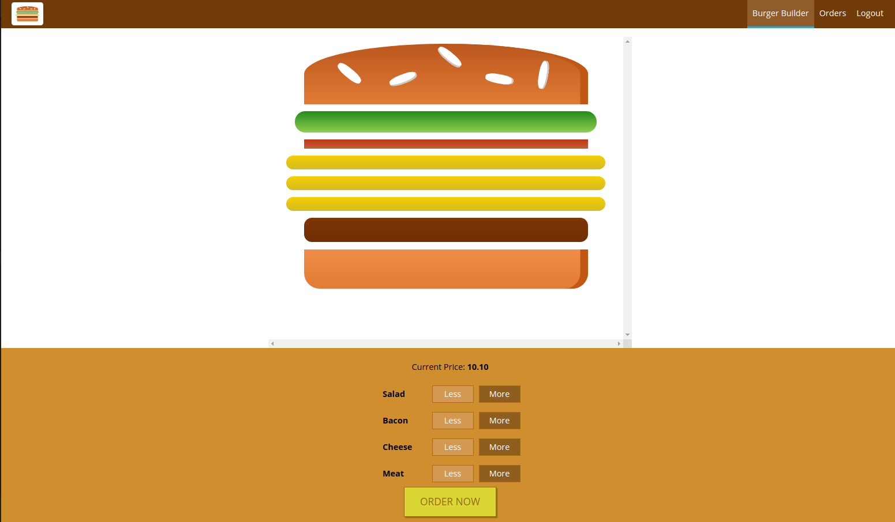

# burger builder

  

Build a burger with the browser. Created using React, Redux, Firebase and more.

## Installation

Install the dependencies:

### `npm install`

Run the development server:

### `npm start`
